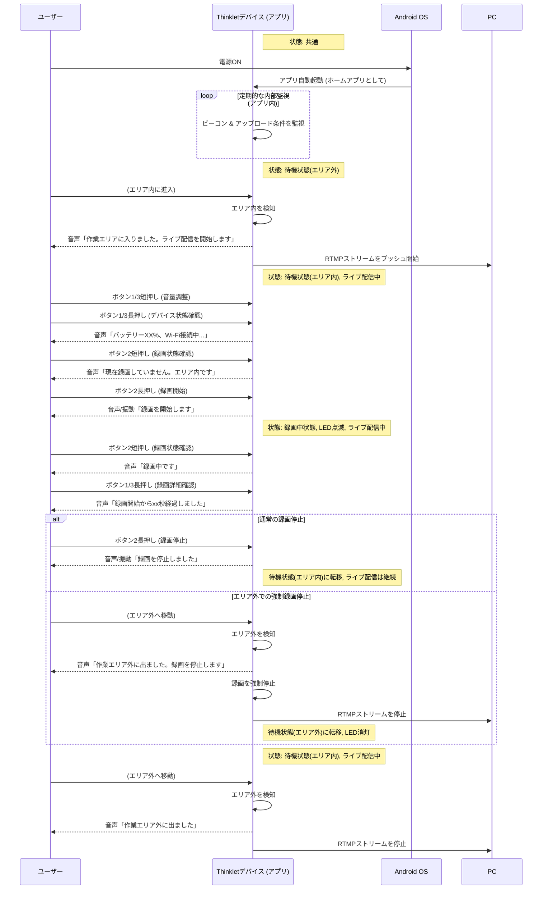
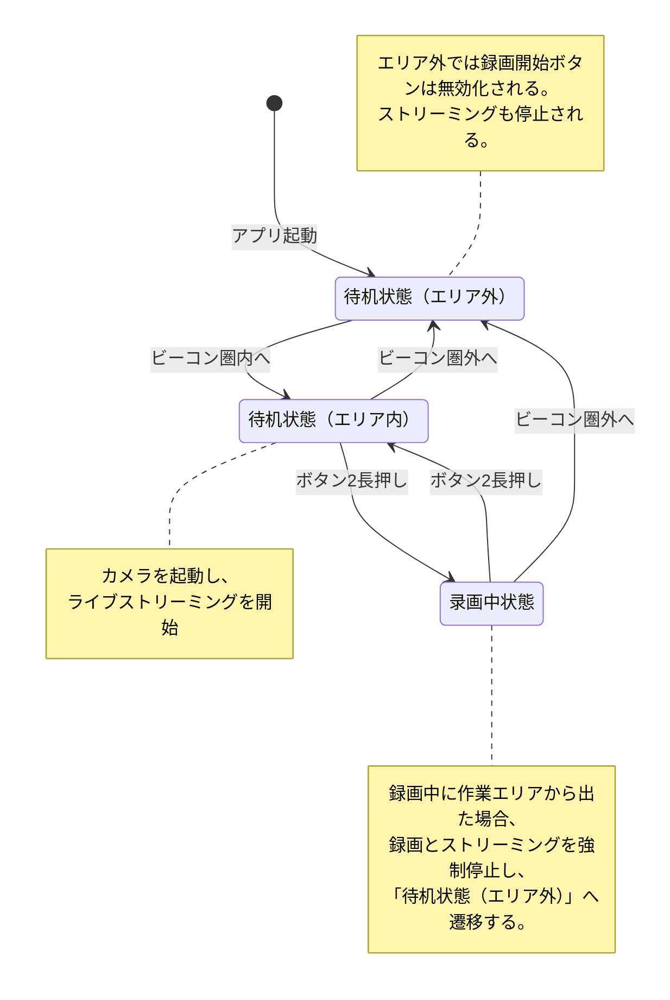
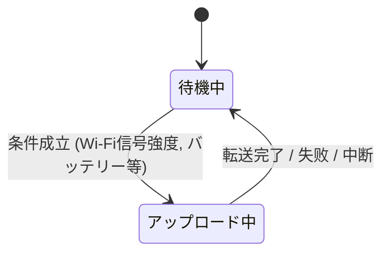

# 現場作業者用アンドロイドアプリ 詳細仕様書

## 1. はじめに

### 1.1. 本書の目的
本書は、Thinkletデバイス上で動作する録画・データ転送アプリケーションの仕様を詳細に定義するものである。開発者が本書に基づいて実装できるよう、各機能のトリガー、処理フロー、正常系・異常系処理、および状態遷移を具体的に記述する。

### 1.2. 開発の背景
現場作業員がハンズフリーで録画操作を行い、デバイスの状態を容易に把握し、録画データを確実にPCへ転送できるようにすることが求められている。本アプリケーションは、物理ボタンによるシンプルな操作、音声・振動によるフィードバック、データ転送の自動化により、現場作業の負担を軽減することを目的とする。

## 2. システム概要
本アプリケーションは、デバイスの電源ONで自動起動し、常駐するサービスである。物理ボタン操作による録画制御、デバイス状態の能動的・受動的な通知、特定条件下でのPCへのデータ自動転送、およびBLEビーコンを利用した録画エリア制御機能を提供する。

---

## 3. 機能仕様

本デバイスは3つの物理ボタンを持つ。本書では、それぞれのボタンを以下のように定義する。
- **ボタン1:** 最も首から遠いボタン
- **ボタン2:** 中央のボタン
- **ボタン3:** 最も首に近いボタン

### 3.1. アプリケーション自動起動
**[優先度: 高]**
- **機能ID:** AND-FUNC-001
- **概要:** デバイスの電源がONになった際に、本アプリケーションを自動的に起動し、バックグラウンドで常駐させる。
- **トリガー:** Android OSの起動完了 (`BOOT_COMPLETED` ブロードキャスト)。
- **処理フロー:**
  1. OSから起動完了通知を受け取る。
  2. アプリケーションのメインサービスを開始する。
  3. サービスはバックグラウンドで動作し、各機能（ボタン入力待受、状態監視など）を開始する。
  4. 初期状態を「待機状態（エリア内）」に設定する。

### 3.2. 録画制御機能
**[優先度: 高]**
- **機能ID:** AND-FUNC-002
- **概要:** 物理ボタンを使用して、動画の録画開始・停止を制御する。各ボタンの具体的な操作は3.3節の表を参照。
- **状態遷移:**
  - `待機状態` で `ボタン2` を長押し → `録画中状態` へ遷移。
  - `録画中状態` で `ボタン2` を長押し → `待機状態` へ遷移。
- **処理フロー (録画開始):**
  1. `待機状態` であることを確認する。
  2. カメラリソースを初期化し、録画設定を適用する。
  3. システム時刻を取得し、現地の実際時刻に基づいてファイル名（例: `VID_{yyyyMMdd_HHmmss}.mp4`）を決定し、ストレージに空ファイルを作成する。
  4. 録画を開始する。
  5. ユーザーに「録画を開始します」と音声通知し、長い振動を1回発生させる。
  6. デバイスのLEDを点滅させる。
- **処理フロー (録画停止):**
  1. `録画中状態` であることを確認する。
  2. 録画を正常に停止し、ファイルを保存する。
  3. カメラリソースを解放する。
  4. ユーザーに「録画を停止しました」と音声通知し、短い振動を2回発生させる。
  5. LEDの点滅を停止する。
- **異常系処理:**
  - ストレージ容量不足で録画開始できない場合、「メモリ残量が不足しています」と音声通知する。
  - システム時刻が取得できない場合、デフォルトのファイル名形式を使用し、ログに警告を記録する。
  - 録画中にエラーが発生した場合、ファイルを可能な限り保存し、「録画エラーが発生しました」と音声通知する。

### 3.3. デバイス状態通知機能
**[優先度: 高]**
- **機能ID:** AND-FUNC-003
- **概要:** 音声を用いて、デバイスの様々な状態をユーザーにフィードバックする。
- **物理ボタン割り当て:**

  | 状態 | ボタン | 短押し操作 | 長押し操作 |
  | :--- | :--- | :--- | :--- |
  | **待機状態** | ボタン1 (最外側) | 音量を下げる | バッテリー残量、ネットワーク状態、ストレージ残量を順に音声通知する |
  | | ボタン2 (中間) | 「現在録画していません。作業エリア（内／外）です」と通知 | **録画開始**（3.2. 録画制御機能） |
  | | ボタン3 (最内側) | 音量を上げる | バッテリー残量、ネットワーク状態、ストレージ残量を順に音声通知する |
  | **録画中状態** | ボタン1 (最外側) | 無効 | 録画詳細（例：「録画開始からxx秒経過しました」）を音声通知する |
  | | ボタン2 (中間) | 「録画中です」と通知 | **録画停止**（3.2. 録画制御機能） |
  | | ボタン3 (最内側) | 無効 | 録画詳細（例：「録画開始からxx秒経過しました」）を音声通知する |

- **自動通知トリガーと内容:**
  - **バッテリー残量低下:**
    - **条件:** バッテリー残量が20%を下回った場合。
    - **処理:** 30分ごとに「バッテリー残量が少なくなっています。充電してください」と音声通知 + 短い振動3回。
  - **ストレージ容量低下:**
    - **条件:** ストレージ空き容量が20%を下回った場合。
    - **処理:** 録画開始時に「メモリ残量が少なくなっています」と音声通知 + 短い振動2回。
  - **データ転送:**
    - **開始時:** 「自動データ転送を開始します」と音声通知。
    - **完了時:** 「自動データ転送が完了しました」と音声通知。
    - **エラー時:** 「ネットワークに接続できません」と音声通知 + エラー用振動パターン。

### 3.4. データ自動アップロード機能
**[優先度: 中]**
- **機能ID:** AND-FUNC-004
- **概要:** 特定の条件下で、録画済みファイルをPCへ**バックグラウンドで**自動的にアップロードする。本機能は他の機能（録画など）を阻害しない。
- **トリガー:** 以下の条件が**すべて**満たされた場合:
  1. デバイスが充電中である、**または** バッテリー残量が20%以上である。
  2. 指定されたWi-Fiに接続されており、RSSIが一定値（例: -67 dBm）以上である。
  3. **現在、別のアップロード処理が実行中でないこと。**
- **処理フロー:**
  1. 1分ごとにトリガー条件をチェックする。
  2. 条件が満たされた場合、バックグラウンドサービスとしてアップロード処理を開始する。
  3. PCアプリケーション（サーバーとして機能）に対し、TCP/IPソケット通信で接続を開始する。
  4. ファイルを1つずつ転送する。転送中はLEDを特定のパターンで点灯させるが、録画中の点滅パターンが優先される。
  5. 転送が正常に完了したファイルは、デバイス上から削除する。
  6. 全ファイルの転送が完了したら、PCとの接続を切断し、バックグラウンドサービスを終了する。
- **レジューム機能:**
  - 転送が中断された場合、次回アップロード時に中断したファイルの転送を再開する（ファイル単位での再送）。
- **異常系処理:**
  - PCに接続できない場合、ログに記録し、次のチェックサイクルで再試行する。
  - ファイル転送中にWi-Fiが切断された場合、現在のファイル転送を中断し、次のチェックサイクルで再試行する。

### 3.5. ビーコンによる録画エリア制御
**[優先度: 中]**
- **機能ID:** AND-FUNC-005
- **概要:** BLEビーコンの電波強度を利用して、録画可能エリア内外を判定し、カメラおよびリアルタイムストリーミングを制御する。
- **トリガー:** 定期的なBLEスキャンによるビーコンの検出・非検出。
- **処理フロー:**
  1. アプリケーションはバックグラウンドで定期的に指定されたUUIDのビーコンをスキャンする。
  2. `録画中状態` のときに、ビーコンが5回連続で検出されなくなった（エリア外に出たと判定）場合:
     a. 「作業エリア外に出ました。録画を停止します」と音声通知する。
     b. 自動的に録画を停止する（AND-FUNC-002の録画停止フローを実行）。
     c. **ライブストリーミングを停止し、カメラリソースを解放する**（AND-FUNC-007）。
     d. `待機状態（エリア外）` に遷移する。
  3. `待機状態（エリア内）` のときに、ビーコンが5回連続で検出されなくなった場合:
     a. 「作業エリア外に出ました」と音声通知する。
     b. **ライブストリーミングを停止し、カメラリソースを解放する**（AND-FUNC-007）。
     c. `待機状態（エリア外）` に遷移する。
  4. `待機状態（エリア外）` のときに、ビーコンが3回連続で検出された（エリア内に戻ったと判定）場合:
     a. 「作業エリアに入りました。ライブ配信を開始します」と音声通知する。
     b. **カメラリソースを初期化し、ライブストリーミングを開始する**（AND-FUNC-007）。
     c. `待機状態（エリア内）` に遷移する。
- **異常系処理:**
  - `待機状態（エリア外）` では、ボタン1による録画開始操作を無効化し、いかなる操作をしても録画が開始されないようにする。

### 3.6. アプリケーションの常時前面表示（キオスクモード）
**[優先度: 高]**
- **機能ID:** AND-FUNC-006
- **概要:** 本アプリケーションをデバイスのホームアプリとして設定し、ユーザーがアプリケーションを終了してAndroidシステムのホーム画面に戻ることを防ぐ。
- **トリガー:** アプリケーションの初回起動時、またはOS設定による。
- **処理フロー:**
  1. アプリケーションは、自身が既定のホームアプリ（ランチャー）であるかを確認する。
  2. もし既定でない場合、ユーザー（または管理者）に設定を促す。
  3. 実行中は、Androidの「戻る」ボタンや「ホーム」ボタンの標準的な動作を無効化し、アプリケーション内に留まらせる。
- **異常系処理:**
  - アプリケーションがクラッシュした場合、システムは自動的にアプリケーションを再起動し、キオスクモードを維持する。

### 3.7. カメラ画面ストリーミング功能
**[優先度: 中]**
- **機能ID:** AND-FUNC-007
- **概要:** デバイスが指定された作業エリア内にいる間、カメラを常に有効にし、その映像をWi-Fiネットワークを通じてPC上のサーバーへリアルタイムにストリーミング（RTMPプッシュ）する。
- **トリガー:**
  - **開始:** BLEビーコンを検知し、`待機状態（エリア内）` に遷移した際（AND-FUNC-005と連動）。
  - **停止:** BLEビーコンが検出できなくなり、`待機状態（エリア外）` に遷移した際（AND-FUNC-005と連動）。
- **処理フロー:**
  1. PC側で、指定されたNode.jsベースのメディアサーバー（Node Media Server）を起動しておく。
  2. デバイスが作業エリアに入ると（AND-FUNC-005）、本機能が自動的に有効になる。
  3. アプリケーションはカメラリソースを初期化し、プレビュー状態にする。
  4. 同時に、RTMPストリーミングクライアントを初期化し、ストリーミングを開始する。プッシュ先のURLは `rtmp://<PCのIPアドレス>:1935/thinklet.squid.run/{デバイスID}` とする。
  5. ストリーミング開始時、ユーザーに「作業エリアに入りました。ライブ配信を開始します」と音声通知する。（AND-FUNC-005の通知と統合）
  6. デバイスが作業エリアから出ると、ストリーミングは自動的に停止され、カメラリソースが解放される。「作業エリア外に出ました」という通知を行う。
  7. PC側のウェブブラウザでは、`http://<PCのIPアドレス>:8000/thinklet.squid.run/{デバイスID}/index.m3u8` のURLでライブ映像を視聴できる。
- **異常系処理:**
  - Wi-Fi接続が切れた、またはPC上のサーバーに接続できない場合、ストリーミングは自動的に停止する。アプリケーションは数秒ごとに再接続を試み、接続が回復すればストリーミングを再開する。
  - 再接続に失敗し続ける場合は、「ライブ配信サーバーに接続できません」と定期的に音声通知する。

---

## 4. プロセスフロー図 (Mermaid)
以下に、主要なユースケースにおけるユーザーとアプリケーション間のインタラクションをシーケンス図で示します。

## 5. 状態遷移図 (Mermaid)

本アプリケーションの主要な状態遷移は、以下の2つの独立したプロセスとして考えることができます。

### 5.1. デバイスの操作状態
これはユーザーの操作やビーコンの状態によって変化する、デバイスの主要な状態です。
待机状態ではデバイス状態と录画状態を、录画中状態では录画状態のみが确认できます。これらの确认操作は本状態遷移に影響を与えません。
`录画中状態` には、RTMPによるライブストリーミングが常に伴います。

### 5.2. 自動アップロードのバックグラウンド状態
これはデバイスの操作状態とは独立して、バックグラウンドで実行されるデータアップロードプロセスの状態です。上記のどの操作状態であっても、条件が満たされればこのプロセスは開始されます。

---

## 6. 非機能要件
- **バッテリー消費:** 録画中でない待機状態では、バッテリー消費を最小限に抑えること。

