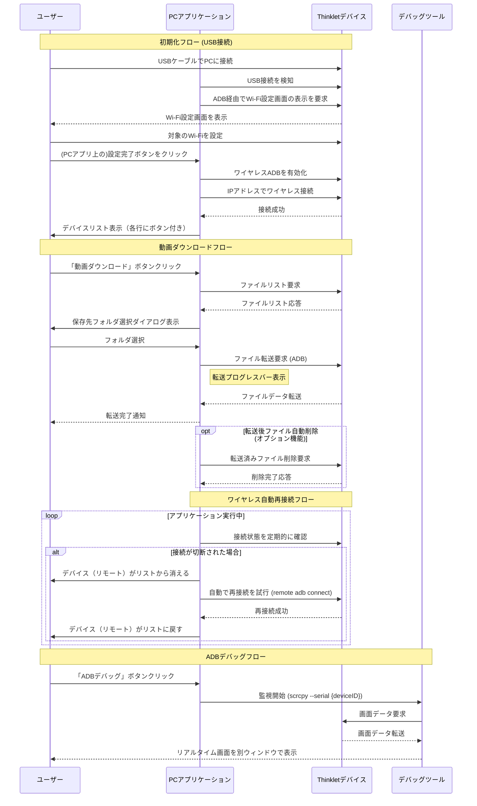

# 開発者デバッグ用ツール 詳細仕様書

## 1. はじめに

### 1.1. 本書の目的
本書は、Thinkletデバイスを管理する開発者デバッグ用ツールの開発にあたり、その仕様を詳細に定義するものである。開発者が本書に基づいて実装できるよう、機能、画面設計、プロセスフロー、非機能要件を具体的に記述する。

### 1.2. 開発の背景
開発者がThinkletデバイスを容易に管理するための仕組みが必要とされている。本アプリケーションは、デバイスとの安定的な接続を維持し、直感的なGUI操作を提供することで、運用の簡略化と効率化を目指す。

## 2. システム概要
本アプリケーションは、同一ネットワーク上のThinkletデバイスを自動検出し、ADB画面の遠隔操作、及びデバイス内の動画ファイルをPCにダウンロードする機能を提供するWindowsデスクトップアプリケーションである。

---

## 3. 機能仕様

### 3.1. デバイス管理機能

#### 3.1.1. デバイスの初期化（USB有線接続）
- **機能ID:** PC-FUNC-001
- **概要:** アプリケーションは、USBで有線接続されたThinkletデバイスを自動的に検知する。デバイスのWi-Fiが設定済みの場合、ワイヤレスADB接続を自動で有効化し、デバイスリストに追加する。このUSBによる初期化は、ワイヤレスでの自動検出・再接続機能を利用するために、アプリケーションの起動ごとに必要となる。
- **トリガー:** ThinkletデバイスのUSB接続。
- **処理フロー:**
  1. PCにThinkletデバイスがUSB接続されると、アプリケーションは自動でそれを検出する。
  2. `adb tcpip 5555` コマンドを実行し、ワイヤレスデバッグモードを有効にする。
  3. デバイスのIPアドレスを取得し、`adb connect {デバイスのIPアドレス}` を実行してWi-Fi経由での接続を確立する。
  4. 確立されたワイヤレス接続をデバイスリストに追加する。
- **異常系処理:**
  - Wi-Fiが未接続またはIPアドレスが取得できない場合、ワイヤレス接続は確立せず、有線接続のみがリストに表示されることをユーザーに通知する。

#### 3.1.2. デバイスのワイヤレス自動検出と再接続
- **機能ID:** PC-FUNC-002
- **概要:** USBで一度初期化されたデバイスに対し、アプリケーション実行中にWi-Fi経由での接続を監視し、接続が切断された場合は自動的に再接続を試みる。この機能はPCアプリケーションが閉じられると無効になる。
- **トリガー:** アプリケーション実行中、定期的なタイマー（例: 5秒ごと）。
- **処理フロー:**
  1. アプリケーションは、現在のセッションでUSB初期化されたデバイスのIPアドレスリストを内部的に保持する。
  2. リスト上のデバイスとの通信が途絶え、ステータスが「接続断」に変わると、そのデバイスは自動再接続の対象となる。
  3. バックグラウンドで、対象デバイスのIPアドレスに対して定期的に `adb connect` コマンドを試行する。
  4. 再接続が成功した場合、ステータスを「接続中」に更新する。
  5. デバイスからの応答が途絶えた場合、リスト上の当該デバイスのステータスを「接続断」に変更し、背景色を灰色にする。
- **永続性:** この自動再接続処理は、アプリケーションが実行されている間のみ継続される。アプリケーションを終了すると、保持しているデバイスリストは破棄され、次回起動時には再度USBによる初期化が必要となる。

### 3.2. データ転送機能

#### 3.2.1. 動画ファイルの手動ダウンロード
- **機能ID:** PC-FUNC-003
- **概要:** ユーザーがデバイスリスト内の特定のデバイスに対応する「動画ダウンロード」ボタンをクリックすることで、そのデバイスから動画ファイルをPCにダウンロードする。
- **トリガー:** ユーザーがデバイスリスト内の特定の行にある「動画ダウンロード」ボタンをクリックする。
- **事前条件:** 対象のデバイスが「接続中」であること。
- **処理フロー:**
  1. 対象デバイスに対し、動画ファイルリストの取得要求を送信する。
  2. デバイスからファイルリスト（ファイル名、サイズ、撮影日時）を受信する。
  3. ユーザーにダウンロード先フォルダを指定させるダイアログを表示する。
  4. 指定されたフォルダに、選択された動画ファイルをADB経由で転送する。
  5. 転送中は、プログレスバーで進捗状況を表示する。
  6. 転送完了後、「転送が完了しました」というメッセージをポップアップ表示する。
- **異常系処理:**
  - 転送中にエラーが発生した場合、「転送に失敗しました: (エラー内容)」というメッセージを表示する。
  - PCのディスク容量が不足している場合、転送を開始せずにエラーメッセージを表示する。

#### 3.2.2. 転送後ファイル自動削除（オプション機能、未開発）
- **機能ID:** PC-FUNC-004
- **概要:** ダウンロードが正常に完了した動画ファイルを、デバイス上から自動的に削除する。
- **トリガー:** PC-FUNC-003の処理フローが正常に完了した時点。
- **処理フロー:**
  1. 転送完了したファイル名のリストをデバイスに送信する。
  2. デバイス側で該当ファイルを削除するよう要求する。
  3. デバイスからの削除完了通知をもって、一連の処理を終了する。
- **異常系処理:**
  - デバイスからの削除完了通知が返ってこない場合、PCアプリ側でログにエラーを記録するが、ユーザーへの通知は行わない（転送は成功しているため）。

### 3.3. ADBデバッグ機能
- **機能ID:** PC-FUNC-005
- **概要:** 選択したデバイスのリアルタイム画面をPC上の別ウィンドウに表示する。
- **トリガー:** ユーザーがデバイスリスト内の特定の行にある「ADBデバッグ」ボタンをクリックする。
- **処理フロー:**
  1. ユーザーがリスト内の特定のデバイスに対応する「ADBデバッグ」ボタンをクリックする。
  2. 対象デバイスのIDを取得する。
  3. `scrcpy` (Screen Copy) を、対象デバイスを指定して別プロセスとして起動する。(コマンド例: `scrcpy --serial {デバイスID}`)
  4. 画面ミラーリング用の新しい独立したウィンドウが表示される。
  5. ユーザーはこのウィンドウをいつでも閉じることができる。再度ボタンをクリックすれば、新しいウィンドウとして再び開くことができる。
- **異常系処理:**
  - `scrcpy` がインストールされていない、またはパスが通っていない場合、「デバッグツールの起動に失敗しました。scrcpyがインストールされているか確認してください。」というエラーメッセージを表示する。
  - デバイスとの接続が切断された場合、既に開かれているミラーリングウィンドウを自動的に閉じる。
---

## 4. 画面仕様

### 4.1. メイン画面
- **画面ID:** PC-SCR-001
- **概要:** アプリケーションのメイン画面。接続中のデバイスリストと、各デバイスに対する操作ボタンで構成される。
- **画面レイアウト:**
  - **ウィンドウタイトル:** 「Thinklet 開発者デバッグ用ツール」
  - **右部:**
    - **デバイスリスト表示エリア (ListView/DataTable):**
      - **カラム:** デバイスID, 接続状態, 操作
      - 各行が1台のデバイスに対応する。
      - 「接続断」のデバイスは行全体を灰色で表示する。
      - **「操作」カラムの内容:**
        - 各行に横並びで2つのボタンを配置する。
          - **「動画ダウンロード」ボタン:** PC-FUNC-003をトリガーする。
          - **「ADBデバッグ」ボタン:** PC-FUNC-005をトリガーする。
  - **左部:**
    - **ステータスバー:**
      - 現在のアプリケーションの状態（例: 「デバイス検索中...」、「デバイス {ID} のデバッグ画面を表示中」）や、処理結果を表示する。

## 5. プロセスフロー図 (Mermaid)

---

## 6. 非機能要件

- **パフォーマンス:** 5台のデバイスが同時に接続されても、UIがフリーズしないこと。
- **対応OS:** Windows 10, Windows 11。
- **依存関係:** 
  - ADB (Android Debug Bridge) がPCにインストールされ、パスが通っていること。
  - scrcpy がPCにインストールされ、パスが通っていること。
